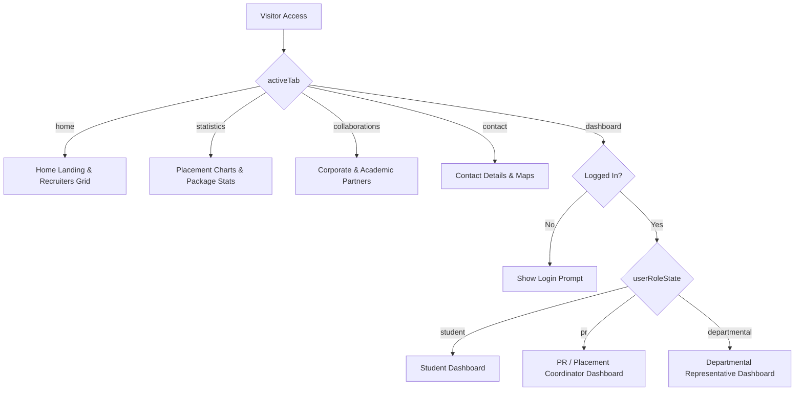

# NIT Puducherry Placement Portal Architecture

The placement portal is structured as a client-side state-driven Single Page Application (SPA) within a single file (`index.tsx`). Navigation and page transitions are controlled via React state variables instead of a traditional router.

---

## 1. Core Navigation & Routing Logic

The interface renders sections conditionally based on two main state variables:
- `activeTab`: Controls which main page is active (`"home" | "statistics" | "collaborations" | "contact" | "dashboard"`).
- `isLoggedIn` & `userRoleState`: Restricts access to student, PR, or departmental dashboards.

---

## 2. Dashboard Sub-Routing & Views

Once authenticated and redirected to `activeTab === "dashboard"`, each user role accesses a specialized menu driven by sub-tab state hooks:

### A. Student Dashboard (`studentDashTab` state)
- **Profile Tab (`"profile"`)**: Displays summary stats, academic summary (CGPA, roll number), personal details, achievements, and the newly updated state-bound status settings form.
- **Companies Tab (`"companies"`)**: Displays job openings, application status, minimum CGPA rules, and eligibility checks (including blocking placed students).
- **Schedule Tab (`"schedule"`)**: Lists upcoming events, registration forms, and interview locations.
- **Preparation Tab (`"preparation"`)**: Interactive prep materials and launchpads for coding assessments.
- **Resume ATS (`"resume-ats"`)**: Evaluates resumes against job descriptions, grading key skills and formatting.

### B. Placement Representative (PR) Dashboard (`prDashTab` state)
- **Drives Manager (`"companies"`)**: Allows coordinators to create and edit company packages, average offers, and eligibility CGPA thresholds.
- **Schedule Manager (`"schedule"`)**: Publishes campus events, talks, and test dates.
- **Student Verification (`"students"`)**: Lists all registered candidates; allows PRs to toggle individual eligibility status.
- **Analytics (`"stats"`)**: Department-wise placement rate charts.

### C. Departmental Coordinator Dashboard (`departmentalDashTab` state)
- **Student Registry (`"students"`)**: Read-only directory of departmental student profile cards.
- **Academic Charts (`"stats"`)**: Aggregated visual trackers monitoring averages and year-over-year progression.

---

## 3. Interactive Overlays & Modals

Modals are managed as overlay portals rendering at the root DOM level based on active state variables:
1. **Login Overlay (`isLoginOpen`)**: Toggles credentials verification panels for Students, PRs, and Faculty.
2. **Account Settings (`isAccountModalOpen`)**: Configures login email/passwords and logs out sessions.
3. **Assessment Test System (`isMockTestOpen`)**: Runs the timed interactive mock technical/aptitude test sessions.
4. **Company Details Modal (`selectedCompanyDetails`)**: Displays recruiter overview, selection stages, and interview sample questions.
